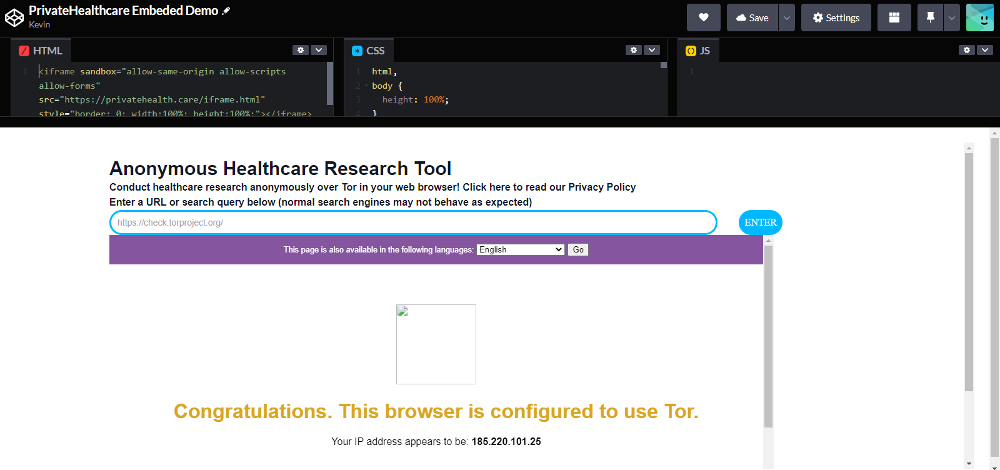

# PrivateHealth.care Embedded

PrivateHealth.care Embedded is a Catalyst Serverless application that lets you embed a powerful anonymous healthcare research tool in your website. This way, law enforcement and censors only see vulnerable users visiting your innocuous website rather than one that is about a topic that may see them penalyzed, such as reproductive, mental, or gender-affirming care. Service provider logs only show a user visiting your website, not privatehealth.care or the websites they used for research. The tool is embeded as an iframe and can be used on any https-enabled website. Catalyst manages security parameters, such as rate limits, allowing us to make a stable and reliable service.

PrivateHealth.care is designed so that people who are stressed about their health do not need to figure out how to use Tor or a web proxy to safely research their care.

PrivateHealth.care is a service that allows you to browse the internet anonymously, so you can complete healthcare research quickly, easily, and without worrying about surveillance from your state or national governement as well as your internet service provider. It accomplishes this by first proxying your web requests and searches out of the USA to Canada. This proxy service then connects to the internet over Tor, a free and open-source network of relays ran by volunteers that keeps journalists and vulnerable people safe every day. Your search or web request will be bounced between several machines before exiting the Tor network in a random location, where that request will be completed. You may notice that your location is somewhere in western Europe for example while browsing on PrivateHealth.care- this is normal and part of how we keep our users safe. Many websites do not currently work correctly through Tor, however we have tested a number of healthcare-related websites that do work and have reached out to the administration of websites that don't to inform them of the critical need to make their services available for those using privacy technology. Search is one thing that does not work correctly over our proxy- instead of navigating to a search engine instead type your query directly in the URL input on the home page and we will proxy your request to Yahoo, a search engine that we have vetted and found to work the best over Tor.
